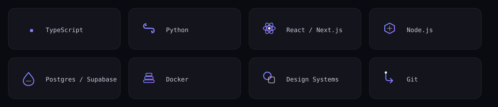

 

# Abhishek Mukherjee

**AI Engineer · Full-Stack Developer**

I design and ship systems that turn ambiguous ideas into fast, reliable software.

 

## Featured Work

<table>
<tr>
<td width="33%" valign="top">

**Jarvis AI OS**
An assistant-first operating layer that turns natural language into real actions across your apps.

</td>
<td width="33%" valign="top">

**RideX**
A ride-hailing platform built for reliability at rush hour — real-time matching without the lag.

</td>
<td width="33%" valign="top">

**MusicFlow**
A music streaming experience with an editorial-grade frontend on top of a real-time listening backend.

</td>
</tr>
</table>

 

## GitHub Analytics

 

  

  

 

## Tech Stack

 

## Terminal

 

## Contact

