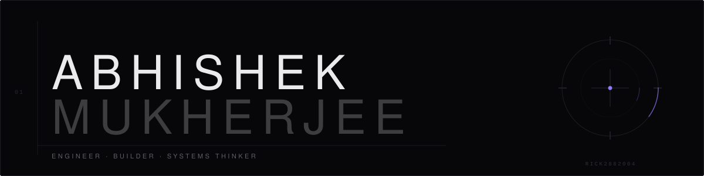
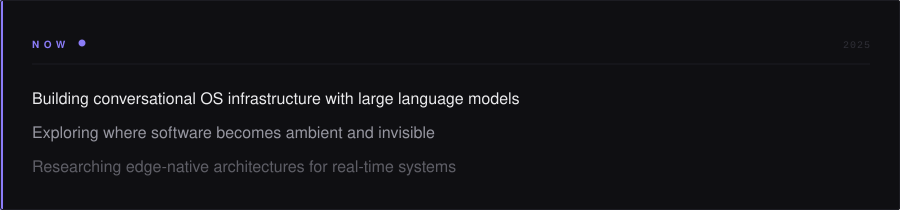
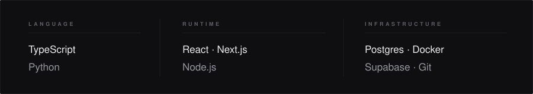

 

I build systems that think — and interfaces that disappear into the experience.

 

 

## Work

**Jarvis AI OS**&ensp;[↗](https://github.com/Rick2882004)  
An assistant-first operating layer that turns natural language into real action across your applications. The interface becomes an intention.

**RideX**&ensp;[↗](https://github.com/Rick2882004/RideX)  
Ride-hailing infrastructure rebuilt for reliability under load. Real-time matching without the lag — engineered for rush hour, not the average case.

**MusicFlow**&ensp;[↗](https://github.com/Rick2882004/musicflow)  
An editorial-quality music experience. A frontend that moves like the music does, sitting on top of a real-time streaming backend.

 

 

## Now

 

 

## Craft

TypeScript and Python for logic. React and Next.js for interfaces that hold up. Node.js, Postgres, and Docker for backbone infrastructure. The stack always follows the problem — never the other way around.

 

 

 

[Email](a.mukherjew581699@gmail.com)&ensp;·&ensp;[LinkedIn](https://www.linkedin.com/in/abhishek-mukherjee-b31906277/)&ensp;·&ensp;[Portfolio](https://abhishekmukherjee.dev)

 
